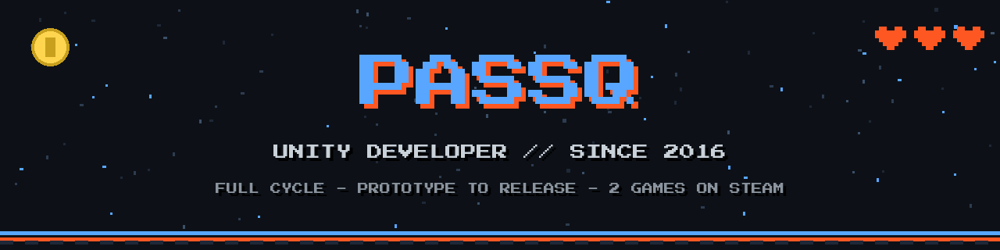
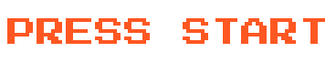

<picture>
  <source media="(prefers-color-scheme: dark)" srcset="banner.png"/>
  <source media="(prefers-color-scheme: light)" srcset="banner-light.png"/>
  
</picture>

 

<table>
<tr>
<td width="60%" valign="top">

## Hi, I'm Alexander

Solo game developer. I build games in **Unity3D / C#** since 2016 - from a raw idea to a release-ready build.

The person you talk to is the person who writes the code. No outsourcing, no handoffs.

</td>
<td width="40%" valign="top">

## Player card

| | |
|---|---|
| **Class** | Unity Developer |
| **Level** | 10 years XP |
| **Platforms** | PC / Android / WebGL |
| **Status** | Open for quests |

</td>
</tr>
</table>

## Skill tree

## Featured projects

<table>
<tr>
<td width="50%" valign="top">

### BUZZ QUIZ

My own product: a quiz creation platform with a built-in editor, Steam Workshop publishing and video export for YouTube / TikTok.

**Release - Q4 2026**

</td>
<td width="50%" valign="top">

### PASSQ.DEV

My interactive portfolio: a retro game-styled website with playable mini-games, achievements and an XP system.

**React + TypeScript + Cloudflare**

</td>
</tr>
</table>

**Shipped client games** - all solo Unity development:

| Genre | Highlight |
|---|---|
| Horror quest | Published on Steam by **Alawar** |
| Farm simulator | Built-in casino with 20+ slot machines |
| Tactical strategy | AI-driven point-control battles, 20+ unit types |
| Physics arcade | Momentum-based gameplay, persistent level upgrades |
| Music trivia | Data-driven content bundles with in-app purchases |
| Piano learning app | MIDI keyboard support, published on Steam |

## Side quests

- **Interactive exhibitions** - touch-screen installations for museums and brand events, built to run unattended for weeks
- **Rust game server** - my own server with 50+ custom C# plugins and a live player community
- **Telegram bots, WPF desktop apps, crypto trading bots** - C# beyond the game engine

## Contribution quest log

<picture>
  <source media="(prefers-color-scheme: dark)" srcset="https://raw.githubusercontent.com/passq-work/passq-work/output/github-contribution-grid-snake-dark.svg"/>
  <source media="(prefers-color-scheme: light)" srcset="https://raw.githubusercontent.com/passq-work/passq-work/output/github-contribution-grid-snake.svg"/>
  
</picture>

---

**`NEW QUESTS ACCEPTED`**

Open for freelance projects - prototypes, full games, mechanics, fixes.
Reach me through [passq.dev](https://passq.dev)

